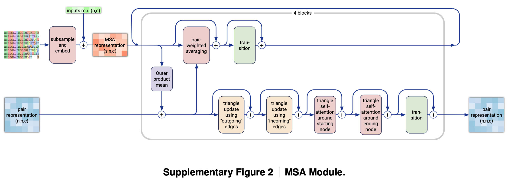

<div align="center">

# AlphaFold 3 - PyTorch (wip)

<a href="https://pytorch.org/get-started/locally/"></a>
<a href="https://pytorchlightning.ai/"></a>
<a href="https://hydra.cc/"></a>
<a href="https://github.com/ashleve/lightning-hydra-template"></a><br>

<!-- [](https://www.nature.com/articles/s41586-024-07487-w) -->

<!-- [](https://papers.nips.cc/paper/2020) -->



</div>

## Description

Implementation of <a href="https://www.nature.com/articles/s41586-024-07487-w">AlphaFold 3</a> in Pytorch

Getting a fair number of emails. You can chat with me about this work <a href="https://discord.gg/x6FuzQPQXY">here</a>

## Appreciation

- <a href="https://github.com/joseph-c-kim">Joseph</a> for contributing the Relative Positional Encoding and the Smooth LDDT Loss!

- <a href="https://github.com/engelberger">Felipe</a> for contributing Weighted Rigid Align, Express Coordinates In Frame, Compute Alignment Error, and Centre Random Augmentation modules!

## Contents

- [Installation](#installation)
- [Usage](#usage)
- [For developers](#for-developers)
- [Citations](#citations)

## Installation

### Pip

```bash
pip install alphafold3-pytorch
```

### Docker

```bash
# Clone project
git clone https://github.com/lucidrains/alphafold3-pytorch
cd alphafold3-pytorch

# Build Docker container
docker build -t af3 .

# Run container (with GPUs)
docker run --gpus all -it af3
```

## Usage

Train model with default configuration

```bash
# Train on CPU
python src/train.py trainer=cpu

# Train on GPU
python src/train.py trainer=gpu
```

Train model with chosen experiment configuration from [configs/experiment/](configs/experiment/)

```bash
python src/train.py experiment=experiment_name.yaml
```

You can override any parameter from command line like this

```bash
python src/train.py trainer.max_epochs=20 data.batch_size=64
```

## For developers

### Contributing

At the project root, run

```bash
bash contribute.sh
```

Then, add your module to `alphafold3_pytorch/alphafold3.py`, add your tests to `tests/test_af3.py`, and submit a pull request. You can run the tests locally with

```bash
pytest tests/
```

### Dependency management

We use `pip` and `docker` to manage the project's underlying dependencies. Notably, to update the dependencies built by the project's `Dockerfile`, first edit the contents of the `dependencies` list in `pyproject.toml`, and then rebuild the project's `docker` image:

```bash
docker stop <container_id> # First stop any running `af3` container(s)
docker rm <container_id> # Then remove the container(s) - Caution: Make sure to push your local changes to GitHub before running this!
docker build -t af3 . # Rebuild the Docker image
docker run --gpus all -it af3 # # Lastly, (re)start the Docker container from the updated image
```

### Code formatting

We use `pre-commit` to automatically format the project's code. To set up `pre-commit` (one time only) for automatic code linting and formatting upon each execution of `git commit`:

```bash
pre-commit install
```

To manually reformat all files in the project as desired:

```bash
pre-commit run -a
```

Refer to [pre-commit's documentation](https://pre-commit.com/) for more details.

## Citations

```bibtex
@article{Abramson2024-fj,
  title    = "Accurate structure prediction of biomolecular interactions with
              {AlphaFold} 3",
  author   = "Abramson, Josh and Adler, Jonas and Dunger, Jack and Evans,
              Richard and Green, Tim and Pritzel, Alexander and Ronneberger,
              Olaf and Willmore, Lindsay and Ballard, Andrew J and Bambrick,
              Joshua and Bodenstein, Sebastian W and Evans, David A and Hung,
              Chia-Chun and O'Neill, Michael and Reiman, David and
              Tunyasuvunakool, Kathryn and Wu, Zachary and {\v Z}emgulyt{\.e},
              Akvil{\.e} and Arvaniti, Eirini and Beattie, Charles and
              Bertolli, Ottavia and Bridgland, Alex and Cherepanov, Alexey and
              Congreve, Miles and Cowen-Rivers, Alexander I and Cowie, Andrew
              and Figurnov, Michael and Fuchs, Fabian B and Gladman, Hannah and
              Jain, Rishub and Khan, Yousuf A and Low, Caroline M R and Perlin,
              Kuba and Potapenko, Anna and Savy, Pascal and Singh, Sukhdeep and
              Stecula, Adrian and Thillaisundaram, Ashok and Tong, Catherine
              and Yakneen, Sergei and Zhong, Ellen D and Zielinski, Michal and
              {\v Z}{\'\i}dek, Augustin and Bapst, Victor and Kohli, Pushmeet
              and Jaderberg, Max and Hassabis, Demis and Jumper, John M",
  journal  = "Nature",
  month    = "May",
  year     =  2024
}
```

```bibtex
@inproceedings{Darcet2023VisionTN,
    title   = {Vision Transformers Need Registers},
    author  = {Timoth'ee Darcet and Maxime Oquab and Julien Mairal and Piotr Bojanowski},
    year    = {2023},
    url     = {https://api.semanticscholar.org/CorpusID:263134283}
}
```
