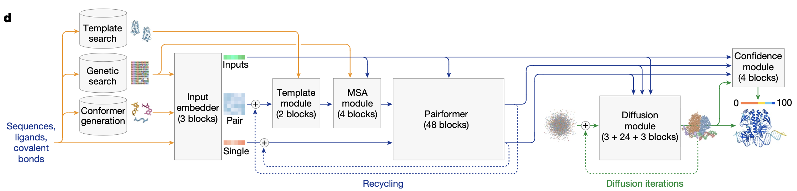

</img>

## Alphafold 3 - Pytorch

Implementation of <a href="https://www.nature.com/articles/s41586-024-07487-w">Alphafold 3</a> in Pytorch

You can chat with other researchers about this work [here](https://discord.gg/Xsq4WaBR9S)

<a href="https://www.youtube.com/watch?v=qjFgthkKxcA">Review of the paper</a> by <a href="https://x.com/sokrypton">Sergey</a>

<a href="https://elanapearl.github.io/blog/2024/the-illustrated-alphafold/">Illustrated guide</a> by <a href="https://elanapearl.github.io/">Elana P. Simon</a>

<a href="https://www.youtube.com/watch?v=AE35XCN5NuU">Talk by Max Jaderberg</a>

A fork with full Lightning + Hydra support is being maintained by <a href="https://github.com/amorehead">Alex</a> at <a href="https://github.com/amorehead/alphafold3-pytorch-lightning-hydra">this repository</a>

A visualization of the molecules of life used in the repository can be seen and interacted with <a href="https://colab.research.google.com/drive/1S9TD8WmS1Gjgwjo9xyEYTbdxgMVVZcQe?usp=sharing">here</a>

## Appreciation

- <a href="https://github.com/joseph-c-kim">Joseph</a> for contributing the Relative Positional Encoding and the Smooth LDDT Loss!

- <a href="https://github.com/engelberger">Felipe</a> for contributing Weighted Rigid Align, Express Coordinates In Frame, Compute Alignment Error, and Centre Random Augmentation modules!

- <a href="https://github.com/amorehead">Alex</a> for fixing various issues in the transcribed algorithms

- <a href="https://github.com/gitabtion">Heng</a> for pointing out inconsistencies with the paper and pull requesting the solutions

- <a href="https://github.com/gitabtion">Heng</a> for finding an issue with the molecular atom indices for the distogram loss

- <a href="https://github.com/luwei0917">Wei Lu</a> for catching a few erroneous hyperparameters

- <a href="https://github.com/amorehead">Alex</a> for the PDB dataset preparation script!

- <a href="https://github.com/milot-mirdita">Milot</a> for optimizing the PDB dataset clustering script!

- <a href="https://github.com/amorehead">Alex</a> for basically writing the entire gargantuan flow from parsing the PDB all the way to the molecule and atomic inputs for training

- <a href="https://github.com/vandrw">Andrei</a> for working on the weighted PDB dataset sampling!

- <a href="https://github.com/tanjimin">Jimin</a> for submitting a small fix to an issue with the coordinates being passed into `WeightedRigidAlign`

- <a href="https://github.com/xluo233">@xluo233</a> for contributing the confidence measures, clash penalty ranking, and sample ranking logic!

- <a href="https://github.com/sj900">sj900</a> for integrating and testing the `WeightedPDBSampler` within the `PDBDataset` and for adding initial support for MSA and template parsing!

- <a href="https://github.com/xluo233">@xluo233</a> again for contributing the logic for computing the model selection score as well as the unresolved rasa!

- <a href="https://github.com/wufandi">Fandi</a> for discovering a few inconsistencies in the elucidated atom diffusion module with the supplementary
  
- <a href="https://github.com/ptosco">Paolo</a> for proposing the `PDB neutral stable molecule` hypothesis!

- <a href="https://github.com/dhuvik">Dhuvi</a> for fixing a bug related to metal ion molecule ID assignment for `Alphafold3Inputs`!

- <a href="https://github.com/dhuvik">Dhuvi</a> for taking on the logic for translating `Alphafold3Input` to `BioMolecule` for saving to mmCIF!

- Tom (from the Discord channel) for identifying a discrepancy between this codebase's distogram and template unit vector computations and those of OpenFold (and <a href="https://github.com/vandrw">Andrei</a> for helping address the distogram issue)!

- <a href="https://github.com/Kaihui-Cheng">Kaihui</a> for identifying a bug in how non-standard atoms were handled in polymer residues!

- <a href="https://github.com/vandrw">Andrei</a> for taking on the gradio frontend interface!

- <a href="https://github.com/patrick-kidger">Patrick</a> for <a href="https://docs.kidger.site/jaxtyping/">jaxtyping</a>, <a href="https://github.com/fferflo">Florian</a> for <a href="https://github.com/fferflo/einx">einx</a>, and of course, <a href="https://github.com/arogozhnikov">Alex</a> for <a href="https://einops.rocks/">einops</a>

- Soumith and the Pytorch organization for giving me the opportunity to open source this work

## Install

```bash
$ pip install alphafold3-pytorch
```

## Usage

```python
import torch
from alphafold3_pytorch import Alphafold3
from alphafold3_pytorch.utils.model_utils import exclusive_cumsum

alphafold3 = Alphafold3(
    dim_atom_inputs = 77,
    dim_template_feats = 108
)

# mock inputs

seq_len = 16

molecule_atom_indices = torch.randint(0, 2, (2, seq_len)).long()
molecule_atom_lens = torch.full((2, seq_len), 2).long()

atom_seq_len = molecule_atom_lens.sum(dim=-1).amax()
atom_offsets = exclusive_cumsum(molecule_atom_lens)

atom_inputs = torch.randn(2, atom_seq_len, 77)
atompair_inputs = torch.randn(2, atom_seq_len, atom_seq_len, 5)

additional_molecule_feats = torch.randint(0, 2, (2, seq_len, 5))
additional_token_feats = torch.randn(2, seq_len, 33)
is_molecule_types = torch.randint(0, 2, (2, seq_len, 5)).bool()
is_molecule_mod = torch.randint(0, 2, (2, seq_len, 4)).bool()
molecule_ids = torch.randint(0, 32, (2, seq_len))

template_feats = torch.randn(2, 2, seq_len, seq_len, 108)
template_mask = torch.ones((2, 2)).bool()

msa = torch.randn(2, 7, seq_len, 32)
msa_mask = torch.ones((2, 7)).bool()

additional_msa_feats = torch.randn(2, 7, seq_len, 2)

# required for training, but omitted on inference

atom_pos = torch.randn(2, atom_seq_len, 3)

distogram_atom_indices = molecule_atom_lens - 1

distance_labels = torch.randint(0, 37, (2, seq_len, seq_len))
resolved_labels = torch.randint(0, 2, (2, atom_seq_len))

# offset indices correctly

distogram_atom_indices += atom_offsets
molecule_atom_indices += atom_offsets

# train

loss = alphafold3(
    num_recycling_steps = 2,
    atom_inputs = atom_inputs,
    atompair_inputs = atompair_inputs,
    molecule_ids = molecule_ids,
    molecule_atom_lens = molecule_atom_lens,
    additional_molecule_feats = additional_molecule_feats,
    additional_msa_feats = additional_msa_feats,
    additional_token_feats = additional_token_feats,
    is_molecule_types = is_molecule_types,
    is_molecule_mod = is_molecule_mod,
    msa = msa,
    msa_mask = msa_mask,
    templates = template_feats,
    template_mask = template_mask,
    atom_pos = atom_pos,
    distogram_atom_indices = distogram_atom_indices,
    molecule_atom_indices = molecule_atom_indices,
    distance_labels = distance_labels,
    resolved_labels = resolved_labels
)

loss.backward()

# after much training ...

sampled_atom_pos = alphafold3(
    num_recycling_steps = 4,
    num_sample_steps = 16,
    atom_inputs = atom_inputs,
    atompair_inputs = atompair_inputs,
    molecule_ids = molecule_ids,
    molecule_atom_lens = molecule_atom_lens,
    additional_molecule_feats = additional_molecule_feats,
    additional_msa_feats = additional_msa_feats,
    additional_token_feats = additional_token_feats,
    is_molecule_types = is_molecule_types,
    is_molecule_mod = is_molecule_mod,
    msa = msa,
    msa_mask = msa_mask,
    templates = template_feats,
    template_mask = template_mask
)

sampled_atom_pos.shape # (2, <atom_seqlen>, 3)
```

An example with molecule level input handling

```python
import torch
from alphafold3_pytorch import Alphafold3, Alphafold3Input

contrived_protein = 'AG'

mock_atompos = [
    torch.randn(5, 3),   # alanine has 5 non-hydrogen atoms
    torch.randn(4, 3)    # glycine has 4 non-hydrogen atoms
]

train_alphafold3_input = Alphafold3Input(
    proteins = [contrived_protein],
    atom_pos = mock_atompos
)

eval_alphafold3_input = Alphafold3Input(
    proteins = [contrived_protein]
)

# training

alphafold3 = Alphafold3(
    dim_atom_inputs = 3,
    dim_atompair_inputs = 5,
    atoms_per_window = 27,
    dim_template_feats = 108,
    num_molecule_mods = 0,
    confidence_head_kwargs = dict(
        pairformer_depth = 1
    ),
    template_embedder_kwargs = dict(
        pairformer_stack_depth = 1
    ),
    msa_module_kwargs = dict(
        depth = 1
    ),
    pairformer_stack = dict(
        depth = 2
    ),
    diffusion_module_kwargs = dict(
        atom_encoder_depth = 1,
        token_transformer_depth = 1,
        atom_decoder_depth = 1,
    )
)

loss = alphafold3.forward_with_alphafold3_inputs([train_alphafold3_input])
loss.backward()

# sampling

alphafold3.eval()
sampled_atom_pos = alphafold3.forward_with_alphafold3_inputs(eval_alphafold3_input)

assert sampled_atom_pos.shape == (1, (5 + 4), 3)
```

## Data preparation

### PDB dataset curation

To acquire the AlphaFold 3 PDB dataset, first download all first-assembly (and asymmetric unit) complexes in the Protein Data Bank (PDB), and then preprocess them with the script referenced below. The PDB can be downloaded from the RCSB: https://www.wwpdb.org/ftp/pdb-ftp-sites#rcsbpdb. The two Python scripts below (i.e., `filter_pdb_{train,val,test}_mmcifs.py` and `cluster_pdb_{train,val,test}_mmcifs.py`) assume you have downloaded the PDB in the **mmCIF file format**, placing its first-assembly and asymmetric unit mmCIF files at `data/pdb_data/unfiltered_assembly_mmcifs/` and `data/pdb_data/unfiltered_asym_mmcifs/`, respectively.

For reproducibility, we recommend downloading the PDB using AWS snapshots (e.g., `20240101`). To do so, refer to [AWS's documentation](https://docs.aws.amazon.com/cli/latest/userguide/cli-chap-welcome.html) to set up the AWS CLI locally. Alternatively, on the RCSB website, navigate down to "Download Protocols", and follow the download instructions depending on your location.

For example, one can use the following commands to download the PDB as two collections of mmCIF files:

```bash
# For `assembly1` complexes, use the PDB's `20240101` AWS snapshot:
aws s3 sync s3://pdbsnapshots/20240101/pub/pdb/data/assemblies/mmCIF/divided/ ./data/pdb_data/unfiltered_assembly_mmcifs
# Or as a fallback, use rsync:
rsync -rlpt -v -z --delete --port=33444 \
rsync.rcsb.org::ftp_data/assemblies/mmCIF/divided/ ./data/pdb_data/unfiltered_assembly_mmcifs/

# For asymmetric unit complexes, also use the PDB's `20240101` AWS snapshot:
aws s3 sync s3://pdbsnapshots/20240101/pub/pdb/data/structures/divided/mmCIF/ ./data/pdb_data/unfiltered_asym_mmcifs
# Or as a fallback, use rsync:
rsync -rlpt -v -z --delete --port=33444 \
rsync.rcsb.org::ftp_data/structures/divided/mmCIF/ ./data/pdb_data/unfiltered_asym_mmcifs/
```

> WARNING: Downloading the PDB can take up to 700GB of space.

> NOTE: The PDB hosts all available AWS snapshots here: https://pdbsnapshots.s3.us-west-2.amazonaws.com/index.html.

After downloading, you should have two directories formatted like this:
https://files.rcsb.org/pub/pdb/data/assemblies/mmCIF/divided/ & https://files.rcsb.org/pub/pdb/data/structures/divided/mmCIF/

```bash
00/
01/
02/
..
zz/
```

For these directories, unzip all the files:

```bash
find ./data/pdb_data/unfiltered_assembly_mmcifs/ -type f -name "*.gz" -exec gzip -d {} \;
find ./data/pdb_data/unfiltered_asym_mmcifs/ -type f -name "*.gz" -exec gzip -d {} \;
```

Next run the commands

```bash
wget -P ./data/ccd_data/ https://files.wwpdb.org/pub/pdb/data/monomers/components.cif.gz
wget -P ./data/ccd_data/ https://files.wwpdb.org/pub/pdb/data/component-models/complete/chem_comp_model.cif.gz
```

from the project's root directory to download the latest version of the PDB's Chemical Component Dictionary (CCD) and its structural models. Extract each of these files using the following command:

```bash
find data/ccd_data/ -type f -name "*.gz" -exec gzip -d {} \;
```

### PDB dataset filtering

Then run the following with `pdb_assembly_dir`, `pdb_asym_dir`, `ccd_dir`, and `mmcif_output_dir` replaced with the locations of your local copies of the first-assembly PDB, asymmetric unit PDB, CCD, and your desired dataset output directory (i.e., `./data/pdb_data/unfiltered_assembly_mmcifs/`, `./data/pdb_data/unfiltered_asym_mmcifs/`, `./data/ccd_data/`, and `./data/pdb_data/{train,val,test}_mmcifs/`).

```bash
python scripts/filter_pdb_train_mmcifs.py --mmcif_assembly_dir <pdb_assembly_dir> --mmcif_asym_dir <pdb_asym_dir> --ccd_dir <ccd_dir> --output_dir <mmcif_output_dir>
python scripts/filter_pdb_val_mmcifs.py --mmcif_assembly_dir <pdb_assembly_dir> --mmcif_asym_dir <pdb_asym_dir> --output_dir <mmcif_output_dir>
python scripts/filter_pdb_test_mmcifs.py --mmcif_assembly_dir <pdb_assembly_dir> --mmcif_asym_dir <pdb_asym_dir> --output_dir <mmcif_output_dir>
```

See the scripts for more options. Each first-assembly mmCIF that successfully passes
all processing steps will be written to `mmcif_output_dir` within a subdirectory
named according to the mmCIF's second and third PDB ID characters (e.g. `5c`).

### PDB dataset clustering

Next, run the following with `mmcif_dir` and `{train,val,test}_clustering_output_dir` replaced, respectively, with your local output directory created using the dataset filtering script above and with your desired clustering output directories (i.e., `./data/pdb_data/{train,val,test}_mmcifs/` and `./data/pdb_data/data_caches/{train,val,test}_clusterings/`):

```bash
python scripts/cluster_pdb_train_mmcifs.py --mmcif_dir <mmcif_dir> --output_dir <train_clustering_output_dir> --clustering_filtered_pdb_dataset
python scripts/cluster_pdb_val_mmcifs.py --mmcif_dir <mmcif_dir> --reference_clustering_dir <train_clustering_output_dir> --output_dir <val_clustering_output_dir> --clustering_filtered_pdb_dataset
python scripts/cluster_pdb_test_mmcifs.py --mmcif_dir <mmcif_dir> --reference_1_clustering_dir <train_clustering_output_dir> --reference_2_clustering_dir <val_clustering_output_dir> --output_dir <test_clustering_output_dir> --clustering_filtered_pdb_dataset
```

**Note**: The `--clustering_filtered_pdb_dataset` flag is recommended when clustering the filtered PDB dataset as curated using the scripts above, as this flag will enable faster runtimes in this context (since filtering leaves each chain's residue IDs 1-based). However, this flag must **not** be provided when clustering other (i.e., non-PDB) datasets of mmCIF files. Otherwise, interface clustering may be performed incorrectly, as these datasets' mmCIF files may not use strict 1-based residue indexing for each chain.

**Note**: One can instead download preprocessed (i.e., filtered) mmCIF (`train`/`val`/`test`) files (~25GB, comprising 148k complexes) and chain/interface clustering (`train`/`val`/`test`) files (~3GB) for the PDB's `20240101` AWS snapshot via a [shared OneDrive folder](https://mailmissouri-my.sharepoint.com/:f:/g/personal/acmwhb_umsystem_edu/EqU8tjUmmKxJr-FAlq4tzaIBi2TIBtmw5Vl3k_kmgNlepA?e=mzlyv6). Each of these `tar.gz` archives should be decompressed within the `data/pdb_data/` directory e.g., via `tar -xzf data_caches.tar.gz -C data/pdb_data/`. One can also download and prepare PDB distillation data using as a reference the script `scripts/distillation_data_download.sh`. Once downloaded, one can run `scripts/reduce_uniprot_predictions_to_pdb.py` to filter this dataset to only examples associated with at least one PDB entry. Moreover, for convenience, a [mapping](https://ftp.uniprot.org/pub/databases/uniprot/current_release/knowledgebase/idmapping/idmapping.dat.gz) of UniProt accession IDs to PDB IDs for training on PDB distillation data has already been downloaded and extracted as `data/afdb_data/data_caches/uniprot_to_pdb_id_mapping.dat`.

## Contributing

At the project root, run

```bash
$ sh ./contribute.sh
```

Then, add your module to `alphafold3_pytorch/alphafold3.py`, add your tests to `tests/test_af3.py`, and submit a pull request. You can run the tests locally with

```bash
$ pytest tests/
```

## Docker Image
The included `Dockerfile` contains the required dependencies to run the package and to train/inference using PyTorch with GPUs.

The default base image is `pytorch/pytorch:2.3.0-cuda12.1-cudnn8-runtime` and installs the latest version of this package from the `main` GitHub branch.

```bash
## Build Docker Container
docker build -t af3 .
```

Alternatively, use build arguments to rebuild the image with different software versions:
- `PYTORCH_TAG`: Changes the base image and thus builds with different PyTorch, CUDA, and/or cuDNN versions.
- `GIT_TAG`: Changes the tag of this repo to clone and install the package.

For example:
```bash
## Use build argument to change versions
docker build --build-arg "PYTORCH_TAG=2.2.1-cuda12.1-cudnn8-devel" --build-arg "GIT_TAG=0.1.15" -t af3 .
```

Then, run the container with GPUs and mount a local volume (for training) using the following command:

```bash
## Run Container
docker run -v .:/data --gpus all -it af3
```

## Citations

```bibtex
@article{Abramson2024-fj,
  title    = "Accurate structure prediction of biomolecular interactions with
              {AlphaFold} 3",
  author   = "Abramson, Josh and Adler, Jonas and Dunger, Jack and Evans,
              Richard and Green, Tim and Pritzel, Alexander and Ronneberger,
              Olaf and Willmore, Lindsay and Ballard, Andrew J and Bambrick,
              Joshua and Bodenstein, Sebastian W and Evans, David A and Hung,
              Chia-Chun and O'Neill, Michael and Reiman, David and
              Tunyasuvunakool, Kathryn and Wu, Zachary and {\v Z}emgulyt{\.e},
              Akvil{\.e} and Arvaniti, Eirini and Beattie, Charles and
              Bertolli, Ottavia and Bridgland, Alex and Cherepanov, Alexey and
              Congreve, Miles and Cowen-Rivers, Alexander I and Cowie, Andrew
              and Figurnov, Michael and Fuchs, Fabian B and Gladman, Hannah and
              Jain, Rishub and Khan, Yousuf A and Low, Caroline M R and Perlin,
              Kuba and Potapenko, Anna and Savy, Pascal and Singh, Sukhdeep and
              Stecula, Adrian and Thillaisundaram, Ashok and Tong, Catherine
              and Yakneen, Sergei and Zhong, Ellen D and Zielinski, Michal and
              {\v Z}{\'\i}dek, Augustin and Bapst, Victor and Kohli, Pushmeet
              and Jaderberg, Max and Hassabis, Demis and Jumper, John M",
  journal  = "Nature",
  month    = "May",
  year     =  2024
}
```

```bibtex
@inproceedings{Darcet2023VisionTN,
    title   = {Vision Transformers Need Registers},
    author  = {Timoth'ee Darcet and Maxime Oquab and Julien Mairal and Piotr Bojanowski},
    year    = {2023},
    url     = {https://api.semanticscholar.org/CorpusID:263134283}
}
```

```bibtex
@article{Arora2024SimpleLA,
    title   = {Simple linear attention language models balance the recall-throughput tradeoff},
    author  = {Simran Arora and Sabri Eyuboglu and Michael Zhang and Aman Timalsina and Silas Alberti and Dylan Zinsley and James Zou and Atri Rudra and Christopher R'e},
    journal = {ArXiv},
    year    = {2024},
    volume  = {abs/2402.18668},
    url     = {https://api.semanticscholar.org/CorpusID:268063190}
}
```

```bibtex
@article{Puny2021FrameAF,
    title   = {Frame Averaging for Invariant and Equivariant Network Design},
    author  = {Omri Puny and Matan Atzmon and Heli Ben-Hamu and Edward James Smith and Ishan Misra and Aditya Grover and Yaron Lipman},
    journal = {ArXiv},
    year    = {2021},
    volume  = {abs/2110.03336},
    url     = {https://api.semanticscholar.org/CorpusID:238419638}
}
```

```bibtex
@article{Duval2023FAENetFA,
    title   = {FAENet: Frame Averaging Equivariant GNN for Materials Modeling},
    author  = {Alexandre Duval and Victor Schmidt and Alex Hernandez Garcia and Santiago Miret and Fragkiskos D. Malliaros and Yoshua Bengio and David Rolnick},
    journal = {ArXiv},
    year    = {2023},
    volume  = {abs/2305.05577},
    url     = {https://api.semanticscholar.org/CorpusID:258564608}
}
```

```bibtex
@article{Wang2022DeepNetST,
    title   = {DeepNet: Scaling Transformers to 1, 000 Layers},
    author  = {Hongyu Wang and Shuming Ma and Li Dong and Shaohan Huang and Dongdong Zhang and Furu Wei},
    journal = {ArXiv},
    year    = {2022},
    volume  = {abs/2203.00555},
    url     = {https://api.semanticscholar.org/CorpusID:247187905}
}
```

```bibtex
@inproceedings{Ainslie2023CoLT5FL,
    title   = {CoLT5: Faster Long-Range Transformers with Conditional Computation},
    author  = {Joshua Ainslie and Tao Lei and Michiel de Jong and Santiago Ontan'on and Siddhartha Brahma and Yury Zemlyanskiy and David Uthus and Mandy Guo and James Lee-Thorp and Yi Tay and Yun-Hsuan Sung and Sumit Sanghai},
    year    = {2023}
}
```

```bibtex
@article{Ash2019OnTD,
    title   = {On the Difficulty of Warm-Starting Neural Network Training},
    author  = {Jordan T. Ash and Ryan P. Adams},
    journal = {ArXiv},
    year    = {2019},
    volume  = {abs/1910.08475},
    url     = {https://api.semanticscholar.org/CorpusID:204788802}
}
```

```bibtex
@ARTICLE{Heinzinger2023.07.23.550085,
    author  = {Michael Heinzinger and Konstantin Weissenow and Joaquin Gomez Sanchez and Adrian Henkel and Martin Steinegger and Burkhard Rost},
    title   = {ProstT5: Bilingual Language Model for Protein Sequence and Structure},
    year    = {2023},
    doi     = {10.1101/2023.07.23.550085},
    journal = {bioRxiv}
}
```

```bibtex
@article {Lin2022.07.20.500902,
    author  = {Lin, Zeming and Akin, Halil and Rao, Roshan and Hie, Brian and Zhu, Zhongkai and Lu, Wenting and Santos Costa, Allan dos and Fazel-Zarandi, Maryam and Sercu, Tom and Candido, Sal and Rives, Alexander},
    title   = {Language models of protein sequences at the scale of evolution enable accurate structure prediction},
    elocation-id = {2022.07.20.500902},
    year    = {2022},
    doi     = {10.1101/2022.07.20.500902},
    publisher = {Cold Spring Harbor Laboratory},
    URL     = {https://www.biorxiv.org/content/early/2022/07/21/2022.07.20.500902},
    eprint  = {https://www.biorxiv.org/content/early/2022/07/21/2022.07.20.500902.full.pdf},
    journal = {bioRxiv}
}
```

```bibtex
@article{Li2024SwitchEA,
    title   = {Switch EMA: A Free Lunch for Better Flatness and Sharpness},
    author  = {Siyuan Li and Zicheng Liu and Juanxi Tian and Ge Wang and Zedong Wang and Weiyang Jin and Di Wu and Cheng Tan and Tao Lin and Yang Liu and Baigui Sun and Stan Z. Li},
    journal = {ArXiv},
    year    = {2024},
    volume  = {abs/2402.09240},
    url     = {https://api.semanticscholar.org/CorpusID:267657558}
}
```

```bibtex
@article{Nguyen2023MitigatingOI,
    title   = {Mitigating Over-smoothing in Transformers via Regularized Nonlocal Functionals},
    author  = {Tam Nguyen and Tan M. Nguyen and Richard G. Baraniuk},
    journal = {ArXiv},
    year    = {2023},
    volume  = {abs/2312.00751},
    url     = {https://api.semanticscholar.org/CorpusID:264300597}
}
```

```bibtex
@inproceedings{Zhou2024ValueRL,
    title   = {Value Residual Learning For Alleviating Attention Concentration In Transformers},
    author  = {Zhanchao Zhou and Tianyi Wu and Zhiyun Jiang and Zhenzhong Lan},
    year    = {2024},
    url     = {https://api.semanticscholar.org/CorpusID:273532030}
}
```

```bibtex
@article{Zhu2024HyperConnections,
    title   = {Hyper-Connections},
    author  = {Defa Zhu and Hongzhi Huang and Zihao Huang and Yutao Zeng and Yunyao Mao and Banggu Wu and Qiyang Min and Xun Zhou},
    journal = {ArXiv},
    year    = {2024},
    volume  = {abs/2409.19606},
    url     = {https://api.semanticscholar.org/CorpusID:272987528}
}
```
